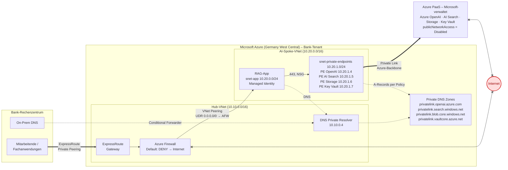

# Enterprise AI Cloud Architecture — Take-Home Assignment (Cloud AI Engineer, LBBW)

Sichere Bereitstellung von Azure AI Services in einem hybriden Bankenumfeld ohne Internet-Pfad.

**Inhalt**

- [Annahmen & Rahmen](#annahmen--rahmen)
- [Teil 1: Netzwerk & Netzisolation](#teil-1-netzwerk--netzisolation)
  - [1.1 Konzept: Unterbindung von Internet-Routen](#11-konzept-unterbindung-von-internet-routen) (Mermaid-Architekturbild)
  - [1.2 Bereitstellung von Azure AI Services](#12-bereitstellung-von-azure-ai-services)
  - [1.3 Hybride Namensauflösung](#13-hybride-namensauflösung)
  - [1.4 Sicherer Zugriff, Authentifizierung & Berechtigungen](#14-sicherer-zugriff-authentifizierung--berechtigungen)
- [Teil 2: Infrastructure as Code](#teil-2-infrastructure-as-code-iac) · Code in [`/infra`](./infra)
- [Teil 3A: Zielstellung IT Security](#teil-3a-zielstellung-it-security)
- [Teil 3B: Datenschutz & Informationssicherheit](#teil-3b-datenschutz--informationssicherheit)
- [Teil 4: Supply Chain Security & Credentials](#teil-4-supply-chain-security--credentials)

---

## Annahmen & Rahmen

| Thema | Annahme |
|---|---|
| Landing Zone | Es existiert eine Azure Landing Zone nach Cloud Adoption Framework (Management Groups, Connectivity-/Identity-/Landing-Zone-Subscriptions). Die AI-Plattform wird als eigene Landing-Zone-Subscription („Spoke") angebunden. |
| Anbindung RZ ↔ Azure | ExpressRoute mit **Private Peering** (redundant, zwei Peering-Locations). Kein Microsoft Peering, keine Public-IP-basierte Anbindung. Site-to-Site-VPN höchstens als Notfall-Backup. |
| Region | Germany West Central (Frankfurt) als Primärregion; Sweden Central als Sekundärregion für Modellverfügbarkeit (Datenverarbeitungsregion wird in Teil 3B behandelt). |
| Use Case | Interne RAG-/Assistenz-Anwendung: Azure OpenAI (über eine Azure AI Services-/Foundry-Ressource), Azure AI Search, Storage Account, Key Vault; Konsument ist eine bankinterne Anwendung (Container Apps/App Service) im AI-Spoke. |
| Identität | Microsoft Entra ID ist mit dem On-Premises-Verzeichnis synchronisiert (Hybrid Identity); Conditional Access und PIM sind lizenziert. |
| Regulatorik | MaRisk/BAIT, DORA, EBA-Outsourcing-Guidelines, DSGVO. Konkrete Kontrollen werden in Teil 3A/3B referenziert. |
| Begriffe | Microsoft benennt Azure AI Services aktuell als „Foundry Tools" und Azure OpenAI als „Azure OpenAI in Foundry Models". Ich verwende hier die etablierten Namen *Azure OpenAI* und *Azure AI Services*; die Ressourcentypen (`Microsoft.CognitiveServices/accounts`) sind identisch. |

---

## Teil 1: Netzwerk & Netzisolation

> **Aufgabenstellung (PDF):** Du bist in einer Bank mit hohen regulatorischen Anforderungen tätig. Die Kommunikation über das globale Internet ist grundsätzlich untersagt; dennoch sollen moderne Azure Cloud Services sicher, nachvollziehbar und betriebsfähig genutzt werden.


---

### 1.1 Konzept: Unterbindung von Internet-Routen

> **Frage (PDF):** Wie können Azure Services angesprochen werden, wenn Public IPs verboten und Routen ins globale Internet blockiert sind? Erkläre dein Zielbild inkl. eines übersichtlichen Mermaid-Architekturbildes.

**Antwort:** Über **Azure Private Link**. Jeder Dienst erhält einen **Private Endpoint** mit privater IP im Bank-VNet. Das RZ erreicht das VNet über **ExpressRoute Private Peering**. Kein Hop benötigt eine Public IP oder eine Internet-Route.

**Zielbild:**

| # | Baustein | Aufgabe |
|---|---|---|
| 1 | ExpressRoute Private Peering | RZ ↔ Hub über private Adressen. Kein Internet-Transit. |
| 2 | Hub-VNet mit Azure Firewall | Einziger Ein- und Ausgang. UDR `0.0.0.0/0` → Firewall. Keine Internet-Regel. |
| 3 | AI-Spoke-VNet | App und Private Endpoints in getrennten Subnetzen mit NSGs. Peering nur zum Hub. |
| 4 | Private Endpoints + Private DNS Zones | PaaS nur über Private Endpoint. `publicNetworkAccess = Disabled`. |
| 5 | Azure Policy `Deny` | Public IPs und öffentliche Endpunkte technisch unmöglich. |

**Internet-Routen sind dreifach unterbunden:** Egress: UDR → Firewall → Drop. Ingress: keine Public IP. Dienst: `publicNetworkAccess = Disabled`.



Dicke Linie = ExpressRoute und Private Link, durchgezogen = Datenpfad, gestrichelt = DNS, `x--x` = unterbunden.

---

### 1.2 Bereitstellung von Azure AI Services

> **Frage (PDF):** Konzipiere die netzwerkseitige Isolation der benötigten AI-Services. Alle Schnittstellen müssen ausschließlich über bankinterne, kontrollierte und nachvollziehbare Kommunikationspfade erreichbar sein.

**Benötigte Dienste:** Azure OpenAI (Inferenz, Embeddings), Azure AI Search (Vektor-Index), Storage (Quelldokumente), Key Vault (Schlüssel, Zertifikate). Je ein Private Endpoint in `snet-private-endpoints`.

**Isolation je Dienst:**

| Maßnahme | Konfiguration |
|---|---|
| Öffentlicher Endpunkt zu | `publicNetworkAccess = Disabled`, `networkAcls.defaultAction = Deny`, `bypass = None` |
| Segmentierung | NSG: 443 nur aus `snet-app`, explizites Deny. Kein Spoke-zu-Spoke-Peering. |
| Dienst-zu-Dienst | AI Search → Storage und → OpenAI über **Shared Private Links** mit Managed Identity |

**Alle Schnittstellen:**

| Schnittstelle | Bankintern über | Kontrolliert durch | Nachvollziehbar durch |
|---|---|---|---|
| RZ → App | ExpressRoute → Hub | Firewall, NSG | Firewall-Logs, Flow Logs |
| App → Dienste | Private Endpoints | NSG, `defaultAction = Deny`, RBAC | Diagnostic Settings |
| AI Search → Storage, OpenAI | Shared Private Links | Freigabe durch Owner, Managed Identity | Diagnostic Settings |
| Administration | ARM über Private Link | RBAC, PIM, Policy | Activity Log |
| Telemetrie | AMPLS | Nur Private Endpoint | Log Analytics |

Kein Pfad benötigt eine Public IP oder eine Internet-Route.

---

### 1.3 Hybride Namensauflösung

> **Frage (PDF):** Beschreibe, wie Namensauflösung in einem hybriden Setup zwischen On-Premises und Cloud funktionieren muss, damit interne Anwendungen die Services zuverlässig und ohne Internetpfad erreichen.

**Problem:** `aoai-lbbw-ai-prod.openai.azure.com` löst öffentlich auf eine Public IP. Nur die Private DNS Zone `privatelink.openai.azure.com` kennt `A 10.20.1.4`. On-Prem-Clients sehen diese Zone nicht.

**Lösung:**

- **On-Prem → Cloud:** On-Prem-DNS leitet die Azure-Suffixe per **Conditional Forwarder** an den **Inbound Endpoint des DNS Private Resolvers** im Hub (`10.10.0.4`). Azure DNS löst die CNAME-Kette auf und liefert `10.20.1.4` aus der Private Zone.
- **Cloud → On-Prem:** Spoke-VNets nutzen den Inbound Endpoint als DNS-Server. Bank-Domänen leitet der **Outbound Endpoint** an den On-Prem-DNS.

**Konfiguration:**

| Komponente | Einstellung |
|---|---|
| Private DNS Zones | Zentral in der Connectivity-Subscription, an den Hub gelinkt. Für AI Services drei Zonen: `privatelink.openai.azure.com`, `privatelink.cognitiveservices.azure.com`, `privatelink.services.ai.azure.com`. Spokes dürfen keine anlegen (Policy `Deny`). |
| A-Records | Azure Policy `DeployIfNotExists` registriert jeden Private Endpoint. Kein DNS im Workload-Code. |
| On-Prem Forwarder | Öffentliche Suffixe (`openai.azure.com`, `search.windows.net`, `blob.core.windows.net`, `vault.azure.net`, …) → Inbound Endpoint. |
| Spoke-VNet | `dns_servers = 10.10.0.4`. Keine eigenen Zonen-Links. |

**Zuverlässig:** Resolver managed und zonenredundant. Zweiter Inbound Endpoint in der Sekundärregion, Forwarder kennt beide. A-Records per Policy, kein Endpoint ohne Eintrag.

**Ohne Internetpfad:** Forwarder leitet das öffentliche Suffix weiter, nicht nur `privatelink.*`. Azure DNS löst die gesamte Kette. On-Prem-DNS braucht keinen Internet-DNS. Anfrage, Antwort und Verbindung bleiben privat.

---

### 1.4 Sicherer Zugriff, Authentifizierung & Berechtigungen

> **Frage (PDF):** Wie würdest du den Zugriff auf die Services gestalten, damit Anwendungen, technische Identitäten und Menschen nur die notwendigen Rechte erhalten und Zugriffe nachvollziehbar, widerrufbar und auditierbar bleiben?

**Grundsatz:** Nur **Microsoft Entra ID**. API-Keys abgeschaltet. Azure RBAC auf Ressourcen-Scope, an Gruppen, nie an Personen.

**Nur die notwendigen Rechte:**

| Wer | Authentifizierung | Rollen |
|---|---|---|
| **Anwendung** | User-assigned Managed Identity | `Cognitive Services OpenAI User`, `Search Index Data Reader`, `Key Vault Secrets User` |
| **Technische Identitäten** | Managed Identity; CI/CD per Workload Identity Federation (OIDC) | Indexer: `Search Index Data Contributor`, `Storage Blob Data Reader`. CI/CD: Custom Role ohne `roleAssignments/write` |
| **Endanwender** | Entra ID, MFA, Conditional Access | App-Rolle in der RAG-App. Keine Azure-Rolle. App ruft Dienste mit eigener Identität. |
| **Plattform-Engineers** | PIM: eligible, JIT, Genehmigung, zeitlich begrenzt | `Cognitive Services Contributor`, `Network Contributor` |
| **IT Security, Revision** | Entra ID, Gruppe | `Reader`, `Log Analytics Reader` |

Niemand hält `Owner` dauerhaft. Rollenvergabe nur über PIM mit Genehmigung.

**Nachvollziehbar, widerrufbar, auditierbar:**

| Anforderung | Umsetzung |
|---|---|
| Nachvollziehbar | Sign-in-Logs, Activity Log, Data-Plane-Logs, PIM-Aktivierungen mit Begründung. Zentral in Log Analytics. |
| Widerrufbar | Gruppe entfernen oder PIM-Ablauf. Continuous Access Evaluation invalidiert Tokens in Minuten. Kein Key zu rotieren. |
| Auditierbar | Diagnostic Settings per Policy erzwungen. Unveränderliche Aufbewahrung. Periodische Access Reviews. |

---

## Teil 2: Infrastructure as Code (IaC)

> **Aufgabenstellung (PDF):** Lege ein `infra`-Verzeichnis an und dokumentiere, wie ausgewählte Teile deiner Architektur aus Teil 1 als IaC umgesetzt würden.

Code: [`/infra`](./infra). Terraform, Provider `azurerm ~> 4.0`. Validiert mit Terraform 1.5.7 und azurerm 4.81.0 (`terraform validate`, `terraform fmt -check`).

**Ausgewählter Teil: der AI-Spoke.** Der Hub (ExpressRoute, Firewall, DNS-Zonen, Resolver, Policies) existiert in der Landing Zone, gehört dem Plattformteam und wird nur referenziert.

---

### 2.1 Ausschnitt statt Vollimplementierung

> **Frage (PDF):** Wir erwarten keine vollständig lauffähige Implementierung der gesamten Architektur. Zeige stattdessen exemplarisch, wie du zentrale Teile deiner Lösung mit Terraform, Bicep oder einem IaC-Werkzeug deiner Wahl umsetzen würdest.

**Umgesetzte Teile:**

| Datei | Teil 1 | Kernaussage im Code |
|---|---|---|
| `network.tf` | 1.1, 1.3 | Peering mit `use_remote_gateways`. UDR `0.0.0.0/0` → Firewall, BGP-Propagation aus. NSGs mit explizitem Deny. `private_endpoint_network_policies = "Enabled"`. `dns_servers` = Hub-Resolver. |
| `ai-services.tf` | 1.2 | `public_network_access_enabled = false`, `default_action = "Deny"`, `bypass = "None"`, `local_auth_enabled = false`, `custom_subdomain_name`. Private Endpoint. Diagnostic Settings. |
| `search.tf` | 1.2 | `public_network_access_enabled = false`, `local_authentication_enabled = false`. Private Endpoint. Shared Private Links zu Storage und OpenAI. |
| `storage-keyvault.tf` | 1.2 | `default_action = "Deny"`, `shared_access_key_enabled = false`, `rbac_authorization_enabled = true`. Je ein Private Endpoint. |
| `identity.tf` | 1.4 | Zwei User-assigned Managed Identities (App, Indexer) mit getrennten Rollen auf Ressourcen-Scope. |
| `versions.tf` | 1.4 | `use_oidc = true`: Workload Identity Federation, kein Secret. |

**Warum diese Teile:** Der Spoke enthält alle Kontrollen, die für die AI-Plattform neu sind und im Code prüfbar sind: kein Internetpfad, Anbindung an zentrales DNS, Zugriff nur über Entra ID. Hub-Komponenten sind einmalig, für alle Spokes gleich und nicht Teil des Workloads.

---

### 2.2 Struktur & Dokumentation

> **Frage (PDF):** Der Code soll im `infra`-Ordner liegen und durch kurze Dokumentation verständlich machen, welche Architekturentscheidung aus Teil 1 umgesetzt wird, welche Annahmen gelten und welche Grenzen der Ausschnitt hat.

**Struktur:**

```
infra/
├── README.md                 Kurzdoku
├── versions.tf               Provider, Backend, OIDC
├── variables.tf              Hub-Referenzen, Adressräume, Modelle
├── main.tf                   Resource Group
├── network.tf                VNet, Subnetze, Peering, UDR, NSGs
├── ai-services.tf            Azure OpenAI, Deployments, Private Endpoint, Logs
├── search.tf                 AI Search, Private Endpoint, Shared Private Links
├── storage-keyvault.tf       Storage, Key Vault, Private Endpoints
├── identity.tf               Managed Identities, Rollen
├── outputs.tf                Endpunkt, private IP, Client-ID
└── terraform.tfvars.example  Beispielwerte
```

Terraform baut nach Abhängigkeiten: Resource Group → VNet, Subnetze → Dienste → Private Endpoints → Rollen.

**Umgesetzte Architekturentscheidung:** PaaS-Dienste ausschließlich über Private Endpoints, ohne öffentlichen Endpunkt, ohne API-Keys, angebunden an das zentrale DNS des Hubs. Der Code folgt den Microsoft-Vorgaben für Spokes:

| Vorgabe (Hub-Spoke-Referenz, CAF) | Umsetzung |
|---|---|
| Spoke „Use remote gateway", Hub „Allow gateway transit", beide „Allow forwarded traffic" | Beide Peering-Ressourcen in `network.tf` |
| „Disable BGP propagation on the spoke route tables" | `bgp_route_propagation_enabled = false` |
| „Always set explicit deny rules in NSGs" | `deny-all-other-inbound`, Priorität 4000 |
| „All virtual networks use the DNS private resolver hosted in the hub" | `dns_servers = [hub_dns_inbound_ip]` |
| „With DeployIfNotExists you shouldn't integrate DNS in your code" | Kein `private_dns_zone_group` in den Private Endpoints |

**Annahmen:**

| Annahme | Im Code |
|---|---|
| Hub-VNet, ExpressRoute Gateway, Azure Firewall existieren | `hub_vnet_id`, `hub_vnet_name`, `firewall_private_ip` als Eingaben |
| Zentrale Private DNS Zones am Hub gelinkt, Resolver im Hub | `hub_dns_inbound_ip` als Eingabe. Keine Zonen im Code. |
| Plattformteam betreibt `DeployIfNotExists` (DNS-Registrierung) und `Deny`-Policies (Public IP, öffentlicher AI-Zugriff, API-Keys, `privatelink.*`-Zonen) | Spoke ist auch ohne Policies konform. Policies verhindern Aufweichung. |
| Workload-Pipeline darf Rück-Peering im Hub anlegen | `hub_to_spoke`-Peering. Alternativ durch Plattformteam. |
| Zentraler Log Analytics Workspace über AMPLS | `log_analytics_workspace_id` als Eingabe |
| Remote State in Storage mit Private Endpoint | `backend "azurerm" {}` per `-backend-config` |
| Germany West Central; gpt-4o und text-embedding-3-large verfügbar | Defaults in `variables.tf` |

**Grenzen:**

| Grenze | Zielbild | Ausschnitt |
|---|---|---|
| Hub | ExpressRoute, Firewall, DNS, Policies, Bastion, AMPLS | Nur referenziert |
| Anwendung | Container Apps / App Service in `snet-app` | Nur Subnetz, NSG, Route, Identität |
| Shared Private Links | Freigabe durch Ressourcen-Owner | Angelegt. Freigabe manuell außerhalb Terraform. |
| Customer-Managed Keys | CMK für OpenAI, Search, Storage | Key Vault vorhanden, CMK nicht verknüpft |
| Diagnostic Settings | Per Policy erzwungen | Explizit im Code |
| Zweite Region | DNS-Failover, Modellverfügbarkeit | Eine Region |
| Lauffähigkeit | – | `validate` und `fmt -check` erfolgreich. `plan`/`apply` ohne Azure-Zugang nicht ausgeführt. |

---

## Teil 3A: Zielstellung IT Security

> **Aufgabenstellung (PDF):** Erklärung von Schutz- und Zugriffskonzepten in verständlichen Worten: Du musst deine Architektur aus Teil 1 gegenüber IT Security verteidigen und nachvollziehbar begründen, warum sie den Anforderungen einer Bank genügt.

---

### 3A.1 Schutz vor unberechtigtem Zugriff

> **Frage (PDF):** Wie weisen wir nach, dass Angreifer aus dem Internet absolut keine Möglichkeit haben, auf die neu geschaffene KI-Infrastruktur oder deren Endpunkte zuzugreifen?

**Kernaussage:** Ein Angreifer braucht drei Dinge: eine Adresse, einen Weg und einen Dienst, der antwortet. Die Architektur nimmt ihm alle drei. Jede Sperre wirkt unabhängig von den anderen.

**Nachweis:**

| # | Behauptung | Beleg |
|---|---|---|
| 1 | Keine öffentliche IP im AI-Spoke | Ressourceninventar zeigt null Public IPs. Azure Policy `Deny` verhindert das Anlegen. |
| 2 | Kein Weg aus dem Internet | Einziger Eingang ist die Firewall im Hub, Default Deny. Effective Routes zeigen `0.0.0.0/0` → Firewall. |
| 3 | Dienste antworten öffentlich nicht | `publicNetworkAccess = Disabled` auf jedem Dienst. Aufruf von außen liefert HTTP 403. Policy `Deny` sichert die Einstellung. |
| 4 | Keine Anmeldung ohne Bank-Identität | API-Keys abgeschaltet. Jeder Aufruf braucht ein Entra-ID-Token mit Rolle. Sonst HTTP 401. |
| 5 | Es bleibt so | Alle Logs zentral. Defender for Cloud meldet Abweichungen. Externer Scan findet keinen offenen Port. |

**Was ein Angreifer sieht:** Der Name `aoai-lbbw-ai-prod.openai.azure.com` ist öffentlich auflösbar. Das ist Azure-Design. Er zeigt auf eine Microsoft-Adresse, die jede Verbindung ablehnt. Die private IP bleibt unsichtbar.

**Zum Wort „absolut":** Der Nachweis gilt unter der Annahme, dass Azure die Sperren korrekt umsetzt. Das ist vertraglich zugesichert (Teil 3B). Innerhalb dieser Annahme gibt es keinen Listener, keine Route und keine Anmeldung.

---

### 3A.2 Administrative Zugriffe

> **Frage (PDF):** Wie würdest du administrative Berechtigungen gestalten, damit Änderungen kontrolliert, nachvollziehbar und nur durch berechtigte Personen erfolgen? Beschreibe dein Zielbild, ohne dich auf ein einzelnes Produkt festzulegen.

**Grundsatz:** Niemand hat dauerhaft Admin-Rechte auf Produktion. Änderungen laufen über Code und Pipeline. Menschen bekommen Schreibrechte nur auf Zeit, mit Begründung und Genehmigung.

**Zielbild in sieben Prinzipien:**

1. **Nur über Code.** Infrastruktur ist Code. Die Pipeline rollt aus. Nur sie hat dauerhaftes Schreibrecht.
2. **Vier Augen.** Jede Änderung wird von einer zweiten Person freigegeben. Autor und Freigeber sind verschieden.
3. **Keine stehenden Rechte.** Admins aktivieren ihre Rolle bei Bedarf für wenige Stunden. Mit Ticket, Begründung, Genehmigung. Danach erlischt sie.
4. **Starke Anmeldung.** Nur mit MFA, Bank-Gerät und aus dem Bank-Netz.
5. **Trennung der Zuständigkeiten.** Plattformteam: Netz und Firewall. Workload-Team: KI-Dienste. Wer Rollen vergibt, nutzt sie nicht. Rollen gehen an Gruppen, nie an Personen.
6. **Unveränderliches Protokoll.** Jede Änderung, Rollenaktivierung und Anmeldung wird zentral gespeichert. Admins können es nicht löschen.
7. **Regelmäßige Bestätigung.** Alle Rechte auf Produktion werden periodisch bestätigt. Nicht bestätigte Rechte erlöschen.

**Notfallzugang:** Zwei Notfallkonten mit Hardware-Schlüsseln, physisch gesichert. Jede Nutzung löst Alarm aus und wird als Sicherheitsvorfall geprüft.

**Ergebnis:**

| Anforderung | Erfüllt durch |
|---|---|
| Kontrolliert | Kein Weg an der Pipeline vorbei. Manuelle Änderung nur mit Genehmigung und Zeitlimit. |
| Nachvollziehbar | Für jede Änderung: wer geschrieben, wer freigegeben, wann ausgerollt, welche Rolle, wer genehmigt. |
| Nur berechtigte Personen | Richtige Gruppe, starke Anmeldung, aktivierte Rolle, bestätigt im letzten Review. Fehlt eines, scheitert die Änderung. |

---

## Teil 3B: Datenschutz & Informationssicherheit

> **Aufgabenstellung (PDF):** Sichere Datenhaltung und Einhaltung strenger Governance-Vorgaben: Du musst deine Architektur aus Teil 1 gegenüber Datenschutz und Informationssicherheit erklären und zeigen, wie Datenflüsse, Verarbeitung und Speicherung kontrolliert werden.

Stand der Microsoft-Dokumentation: Mai bis August 2026. Quellen am Ende.

---

### 3B.1 Werden unsere Daten für das Training des LLMs genutzt?

> **Frage (PDF):** Arbeite heraus, wie die Datenschutzbestimmungen bezüglich des Verhaltens von Azure OpenAI konfiguriert sind. Beziehe dich explizit auf vertragliche Regelungen sowie das Konzept von Zero Data Retention.

**Antwort:** Nein. Vertraglich zugesichert. Azure OpenAI läuft in Microsofts Azure-Umgebung ohne Verbindung zu OpenAI.

**Vertragliche Regelungen:**

| Dokument | Zusicherung |
|---|---|
| **Product Terms** | Prompts, Completions, Embeddings, Trainingsdaten werden nicht zum Training oder zur Verbesserung von Microsoft- oder OpenAI-Modellen genutzt. Nicht zugänglich für OpenAI oder andere Kunden. |
| **Data Protection Addendum (DPA)** | Microsoft ist Auftragsverarbeiter nach DSGVO. Verarbeitung nur auf Weisung. Regelt Löschung, Unterauftragnehmer, TOMs. |
| **EU Data Boundary** | Speicherung und Verarbeitung von Kundendaten innerhalb der EU. |
| **Azure Compliance** | ISO 27001, SOC 2, C5 (BSI). Externe Prüfung der Zusagen. |

Wörtlich (Microsoft): „The models are stateless: no prompts or completions are stored in the model. Additionally, prompts and completions are not used to train, retrain, or improve the base models."

**Die Ausnahme, Abuse Monitoring:** Microsoft prüft Prompts und Completions automatisch auf Missbrauch. Bei Verdacht kann eine Stichprobe für Human Review gespeichert werden. Für Ressourcen im EWR sitzen die Reviewer im EWR. Speicherung, kein Training.

**Zero Data Retention:** Die Stichprobe ist für eine Bank nicht akzeptabel. Die LBBW beantragt **Modified Abuse Monitoring**:

| Punkt | Detail |
|---|---|
| Wirkung | Keine Speicherung von Prompts und Completions, kein Human Review. Automatische Prüfung in Echtzeit bleibt, ohne Speicherung. |
| Weg | Limited-Access-Antrag. Nur für verwaltete Kunden (Enterprise Agreement). Freigabe durch Microsoft, kein Portal-Schalter. |
| Nachweis | Ressource zeigt `"ContentLogging": "false"`. Prüfbar per Portal oder CLI. |

**Ergebnis mit ZDR:** Microsoft speichert keinen Prompt und keine Completion. Das Modell ist zustandslos. Es bleibt nur, was die Bank selbst protokolliert.

---

### 3B.2 Datenhaltung & Speicherort

> **Frage (PDF):** Wo exakt werden Prompts (Fragen) und Completions (Antworten) verarbeitet und temporär oder dauerhaft gespeichert? Erkläre die Verarbeitungsregionen und den genauen Lebenszyklus der Daten.

**Verarbeitungsregion je Deployment-Typ:**

| Deployment-Typ | Inferenz | At rest |
|---|---|---|
| **Standard** | Azure-Geografie der Ressource (Deutschland) | Geografie der Ressource |
| **Data Zone Standard** | EU Data Boundary | Geografie der Ressource |
| **Global Standard** | Jede Azure-Region | Geografie der Ressource |

**Entscheidung:** `Standard` in Germany West Central (`sku.name = "Standard"` in `infra/variables.tf`). Inferenz und Speicherung in Deutschland. Fallback bei fehlender Modellverfügbarkeit: `Data Zone Standard` (EU). `Global` per Policy verboten.

**Lebenszyklus eines Prompts:**

| Schritt | Ort | Speicherung |
|---|---|---|
| 1. Frage in der RAG-App | AI-Spoke | App-Log in Log Analytics (Bank) |
| 2. Prompt → Azure OpenAI | Private Endpoint → Backbone → Modell in Deutschland | Keine. TLS 1.2 in transit |
| 3. Inferenz | Modell in Deutschland | Keine. Zustandslos |
| 4. Content Filter | Synchron im Dienst | Keine |
| 5. Abuse Monitoring | Automatisch, Echtzeit | Mit ZDR: keine. Ohne ZDR: Stichprobe bei Verdacht, in Deutschland, zeitlich begrenzt |
| 6. Completion → App | Backbone → Private Endpoint | Keine |
| 7. Antwort angezeigt | RAG-App | `RequestResponse`-Log: Identität, Zeit, Modell, Tokens. Inhalt nur, wenn konfiguriert |

Nach Schritt 7 existiert der Prompt nur noch dort, wo die Bank ihn selbst speichert.

**Dauerhaft gespeichert:**

| Daten | Ort | Verschlüsselung | Löschung |
|---|---|---|---|
| Quelldokumente | Storage Account, AI-Spoke, Deutschland | AES-256, optional CMK | Bank, jederzeit |
| Vektor-Index | AI Search, AI-Spoke, Deutschland | AES-256, optional CMK | Bank, jederzeit |
| Logs | Log Analytics der Bank | AES-256 | Nach Bank-Aufbewahrungsfrist |
| Modell | Microsoft, zustandslos | – | Enthält keine Bankdaten |

**Nicht genutzt:** Stored Completions, Assistants Threads, Responses API mit Verlauf, Fine-Tuning, Batch. Diese Features speichern Daten bei Microsoft at rest. RAG braucht sie nicht. Die App hält den Verlauf selbst.

**Hinweis Speicherfrist:** Frühere Fassungen der Microsoft-Dokumentation nannten „bis zu 30 Tage" für Abuse-Monitoring-Stichproben. Die aktuelle Fassung nennt keine Frist. Mit Modified Abuse Monitoring entfällt die Frage.

---

**Quellen (abgerufen 2026-09-11):**
- Data, privacy, and security for Azure OpenAI: https://learn.microsoft.com/en-us/azure/ai-foundry/responsible-ai/openai/data-privacy
- Abuse monitoring: https://learn.microsoft.com/en-us/azure/ai-foundry/openai/concepts/abuse-monitoring
- Deployment types: https://learn.microsoft.com/en-us/azure/ai-foundry/foundry-models/concepts/deployment-types
- Data Protection Addendum: https://aka.ms/DPA
- EU Data Boundary: https://learn.microsoft.com/en-us/privacy/eudb/eu-data-boundary-learn

---

## Teil 4: Supply Chain Security & Credentials

> **Aufgabenstellung (PDF):** Risiken in Build-, Deployment- und Laufzeitumgebungen erkennen und geeignete Schutzmaßnahmen ableiten.

---

### 4.1 Manipulierte Abhängigkeiten und Build-Ketten

> **Frage (PDF):** Open-Source-Abhängigkeiten, Build-Skripte und CI/CD-Prozesse können selbst zum Angriffsvektor werden. Beschreibe, welche Risiken du für eine Cloud-AI-Anwendung siehst und wie du sie bewerten würdest.

**Kernaussage:** Eine Cloud-AI-Anwendung hat drei Lieferketten: Anwendungscode, Infrastrukturcode und KI-Artefakte. Jede ist ein eigener Angriffsvektor.

**Risiken:**

| # | Risiko | Beispiel für die RAG-Anwendung |
|---|---|---|
| 1 | Kompromittiertes Open-Source-Paket | OpenAI-SDK oder RAG-Framework mit Schadcode nach Maintainer-Übernahme |
| 2 | Typosquatting, Dependency Confusion | Öffentliches Paket verdrängt internes Paket gleichen Namens |
| 3 | Manipulierte Pipeline-Actions | Externer Marketplace-Schritt exfiltriert Umgebungsvariablen |
| 4 | Kompromittierter Build-Runner | Runner hält das Deploy-Token für die Infrastruktur |
| 5 | Manipuliertes Basisimage | Backdoor im Container-Image der App |
| 6 | Manipulierte IaC-Module oder Provider | Terraform-Modul öffnet Endpunkt oder schwächt NSG |
| 7 | Manipulierte KI-Artefakte | Modellgewichte mit Code-Ausführung, Prompt-Templates mit versteckten Anweisungen, Tool-Definitionen mit Exfiltration |
| 8 | Secrets in Artefakten | Zugangsdaten in Logs, Images oder Terraform-State |

**Bewertung nach Eintrittswahrscheinlichkeit und Schadenshöhe:**

| Risiko | Wahrscheinlichkeit | Schaden | Priorität |
|---|---|---|---|
| 1, 2 Pakete | Hoch | Hoch: Code läuft mit App-Identität | 1 |
| 4 Build-Runner | Mittel | Sehr hoch: Schreibrechte auf Infrastruktur | 1 |
| 3, 6 Actions, IaC | Mittel | Hoch: kann Netzsperren aus Teil 1 aufheben | 2 |
| 7 KI-Artefakte | Mittel, steigend | Hoch: wirkt auf Inhalte, schwer erkennbar | 2 |
| 5 Basisimage | Mittel | Mittel: begrenzt durch Netzisolation | 3 |
| 8 Secrets | Hoch | Mittel: begrenzt, wenn keine langlebigen Secrets existieren | 3 |

**Einordnung für unsere Architektur:** Die Netzisolation aus Teil 1 begrenzt den Schaden aller Risiken. Kompromittierter Code im Spoke hat keinen Internet-Egress. Das größte Restrisiko ist der Infrastruktur-Runner: Terraform ist immer Push und braucht Schreibrechte. Für die Anwendung ist ein Pull-Modell (GitOps) vorzuziehen, damit der App-Runner keine Cloud-Rechte hält.

---

### 4.2 Umgang mit Zugangsdaten und Vertrauensbeziehungen

> **Frage (PDF):** Wie würdest du verhindern, dass kompromittierte Abhängigkeiten, Skripte oder Pipelines sensible Zugangsdaten missbrauchen können? Formuliere dein Sicherheitskonzept bewusst technologieoffen.

**Grundsatz:** Zugangsdaten werden durch Identitäten ersetzt. Verbleibende Tokens sind kurzlebig und eng gescoped. Fremdcode erhält nie Zugriff darauf.

**Sicherheitskonzept:**

1. **Keine langlebigen Secrets.** Keine API-Keys, Passwörter oder Service-Account-Secrets in Code, Konfiguration oder Pipeline. Dienste mit Key-Auth werden auf Identitäts-Auth umgestellt.
2. **Identität statt Geheimnis.** Anwendungen und Pipelines authentifizieren sich über plattformverwaltete Identitäten. Nachweis ist ein kurzlebiges Token.
3. **Föderiertes Vertrauen.** Die Pipeline weist Repository, Branch und Umgebung nach. Die Cloud stellt daraufhin ein Token aus. Kein Secret wird geteilt.
4. **Rechte pro Pipeline-Stufe.** Build (führt Fremdcode aus) hat keine Cloud-Rechte. Plan hat Leserechte. Apply erhält ein Token nur für die Zielumgebung, nur nach Freigabe.
5. **Fremdcode in Isolation.** Build und Test laufen ohne Zugangsdaten und ohne Egress. Nur geprüfte, signierte Artefakte verlassen die Stufe.
6. **Ephemere Runner.** Jeder Lauf auf frischer Instanz im Bank-Netz. Keine Persistenz zwischen Läufen.
7. **Herkunft und Integrität.** Interne kuratierte Registry, Version-Pinning mit Prüfsummen, SBOM, Signatur und Provenance-Attestierung. Verifikation vor dem Deploy. Policy-as-Code prüft den Terraform-Plan auf verbotene Änderungen.
8. **Widerruf und Audit.** Identitäten sind zentral sperrbar. Kurzlebige Tokens machen den Widerruf sofort wirksam. Jede Token-Ausstellung und -Nutzung wird protokolliert.

**Wirkung bei Kompromittierung:**

| Kompromittiert | Ergebnis für den Angreifer |
|---|---|
| Abhängigkeit | Läuft in der Build-Stufe ohne Zugangsdaten und ohne Egress. Nichts zu holen, nichts zu senden. |
| Build-Skript | Gleiches. Skripte sind gepinnt und reviewpflichtig. |
| Pipeline | Token für Minuten, nur Zielumgebung, nur Apply-Stufe. Kein Secret zum Mitnehmen. Protokolliert, sperrbar. |
| Laufende Anwendung | Identität mit Leserechten auf Index und Inferenz. Kein Egress. |

**Bezug zur Architektur:** Teil 1 und 2 setzen das um. Alle Dienste: `disableLocalAuth`. App und Indexer: Managed Identities mit Rollen auf Ressourcen-Scope. Pipeline: Workload Identity Federation (`use_oidc = true`). Kein Secret in Code, Konfiguration oder State.
